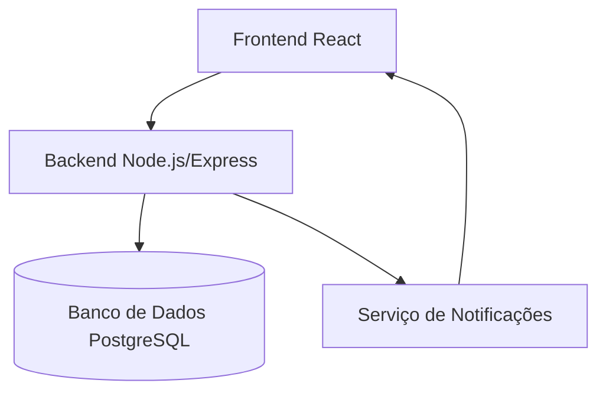
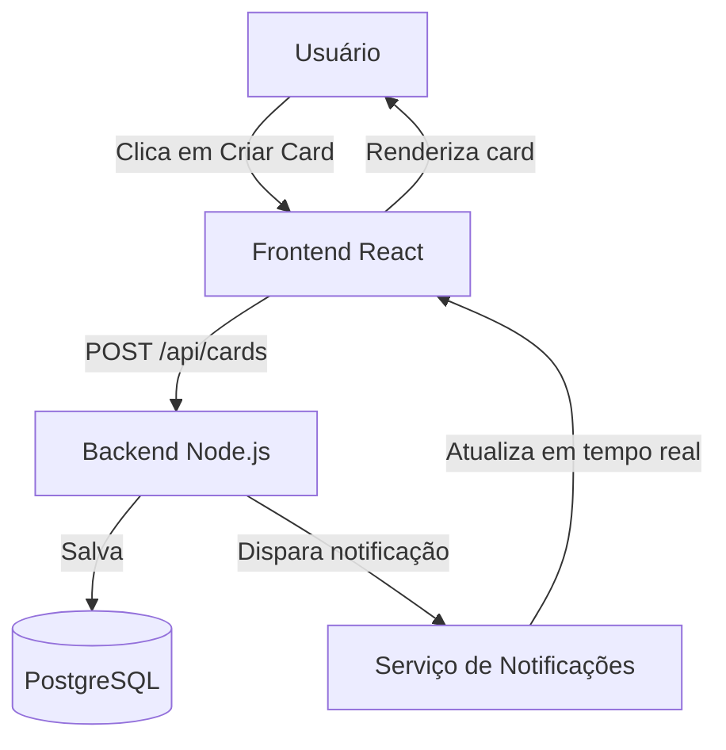
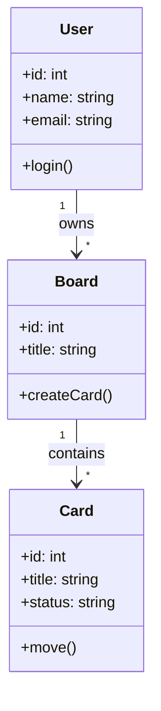
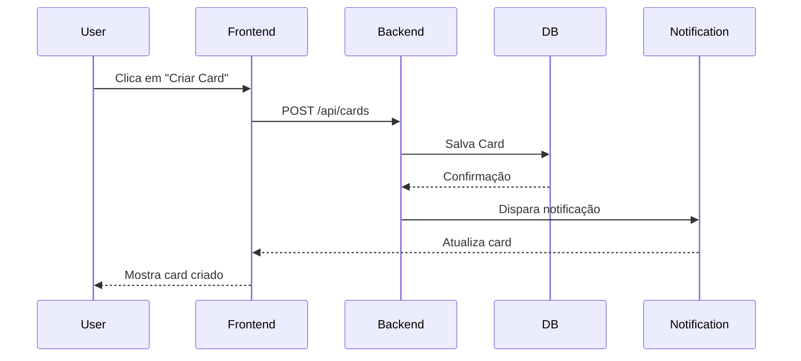
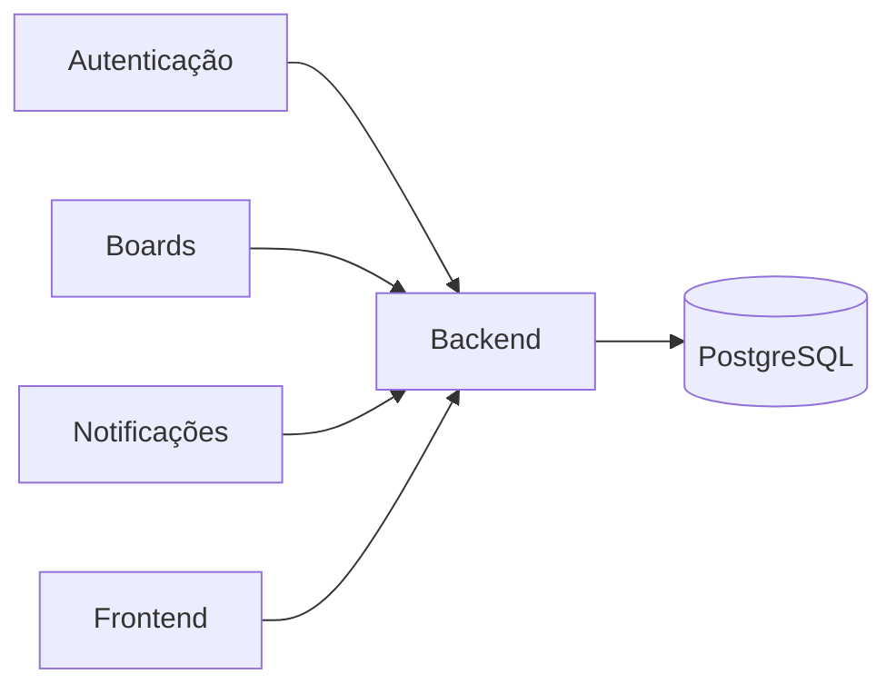

# Projeto My Kanban Bord

## O que e o My Kanban Bord

- Descrição: O My Kanban Bord e um projeto pessoal de minha altoria.

- Objetivo: Me ajudar a gerenciar os meu projetos pessoal.

- funcionalidades:
    - Criar nova coluna
    - Editar nome e cor da coluna
    - Deletar coluna
    - Criar nova tarefa
    - Adicionar nome, cor e descrição da tarefa
    - Editar nome, cor e descrição da tarefa
    - Mover tarefa para outra coluna
    - Marcar tarefa como concluida
    - Deletar tarefa

## Documentação

