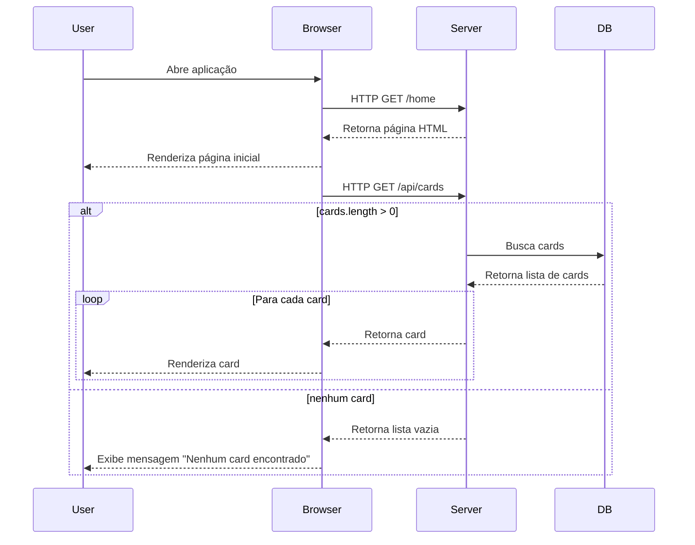
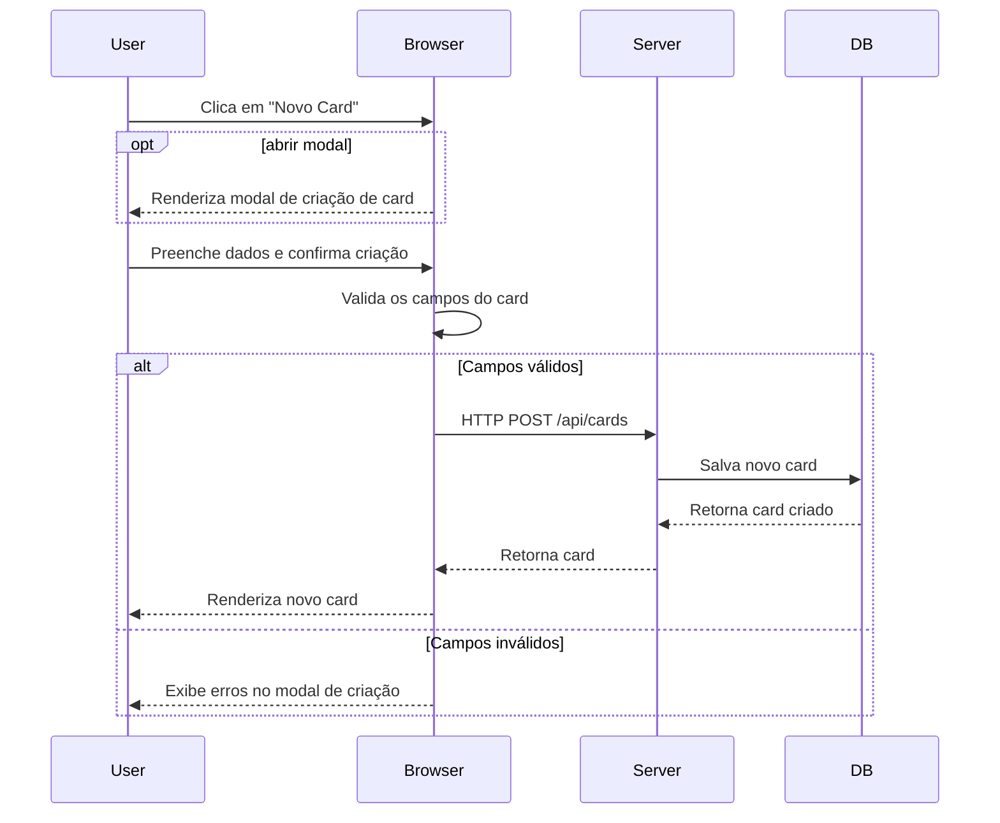
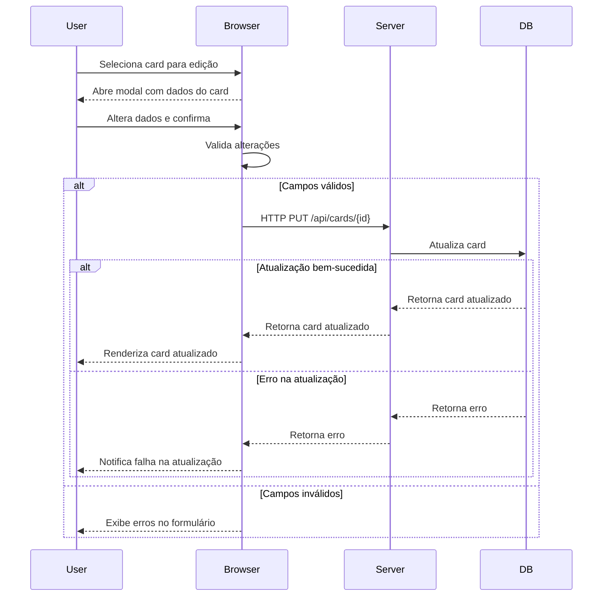
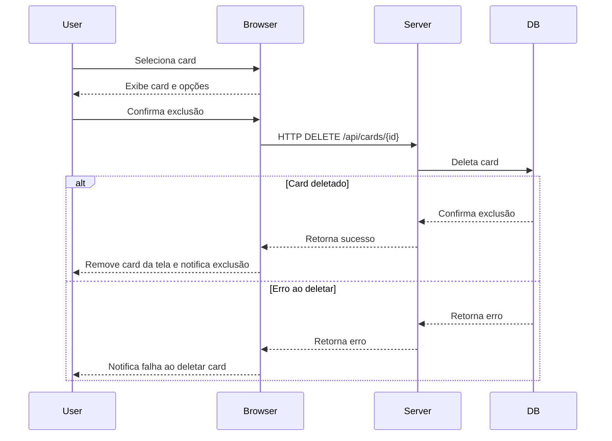
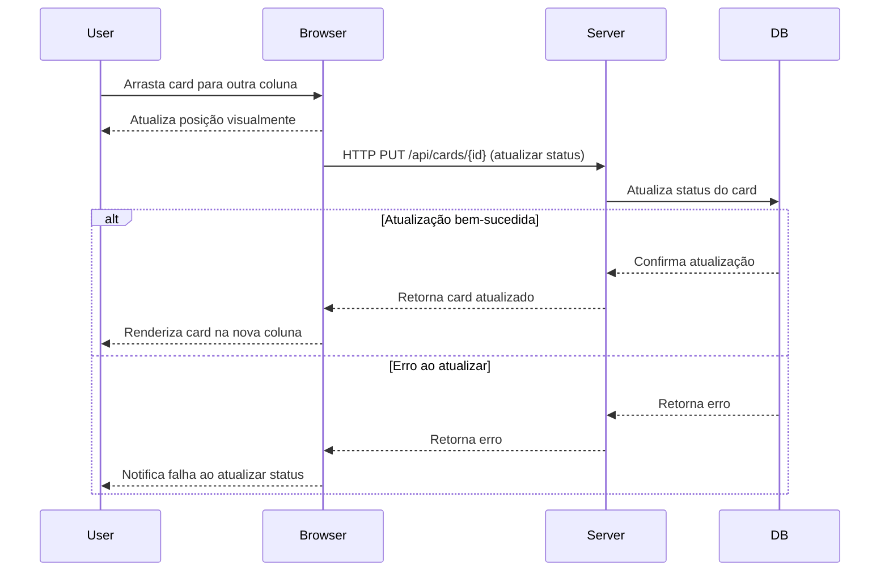

# Modeleagem de Requisitos

## Etapa 1 – Diagrama de Processos

### Abrir aplicação

```mermaid
sequenceDiagram
participant User
participant Browser
participant Server
participant DB

User->>Browser: Abre aplicação
Browser->>Server: HTTP GET /home
Server-->>Browser: Retorna página HTML
Browser-->>User: Renderiza página inicial

Browser->>Server: HTTP GET /api/cards
alt cards.length > 0
Server->>DB: Busca cards
DB-->>Server: Retorna lista de cards
loop Para cada card
Server-->>Browser: Retorna card
Browser-->>User: Renderiza card
end
else nenhum card
Server-->>Browser: Retorna lista vazia
Browser-->>User: Exibe mensagem "Nenhum card encontrado"
end

```

### Criar Novo Card

```mermaid
sequenceDiagram
participant User
participant Browser
participant Server
participant DB

User->>Browser: Clica em "Novo Card"
opt abrir modal
Browser-->>User: Renderiza modal de criação de card
end

User->>Browser: Preenche dados e confirma criação
Browser->>Browser: Valida os campos do card
alt Campos válidos
Browser->>Server: HTTP POST /api/cards
Server->>DB: Salva novo card
DB-->>Server: Retorna card criado
Server-->>Browser: Retorna card
Browser-->>User: Renderiza novo card
else Campos inválidos
Browser-->>User: Exibe erros no modal de criação
end
```

### Editar Card

```mermaid
sequenceDiagram
participant User
participant Browser
participant Server
participant DB

User->>Browser: Seleciona card para edição
Browser-->>User: Abre modal com dados do card

User->>Browser: Altera dados e confirma
Browser->>Browser: Valida alterações
alt Campos válidos
Browser->>Server: HTTP PUT /api/cards/{id}
Server->>DB: Atualiza card
alt Atualização bem-sucedida
DB-->>Server: Retorna card atualizado
Server-->>Browser: Retorna card atualizado
Browser-->>User: Renderiza card atualizado
else Erro na atualização
DB-->>Server: Retorna erro
Server-->>Browser: Retorna erro
Browser-->>User: Notifica falha na atualização
end
else Campos inválidos
Browser-->>User: Exibe erros no formulário
end
```

### Deletar Card

```mermaid
sequenceDiagram
participant User
participant Browser
participant Server
participant DB

User->>Browser: Seleciona card
Browser-->>User: Exibe card e opções

User->>Browser: Confirma exclusão
Browser->>Server: HTTP DELETE /api/cards/{id}
Server->>DB: Deleta card
alt Card deletado
DB-->>Server: Confirma exclusão
Server-->>Browser: Retorna sucesso
Browser-->>User: Remove card da tela e notifica exclusão
else Erro ao deletar
DB-->>Server: Retorna erro
Server-->>Browser: Retorna erro
Browser-->>User: Notifica falha ao deletar card
end
```

### Mudar Status

```mermaid
sequenceDiagram
participant User
participant Browser
participant Server
participant DB

User->>Browser: Arrasta card para outra coluna
Browser-->>User: Atualiza posição visualmente
Browser->>Server: HTTP PUT /api/cards/{id} (atualizar status)
Server->>DB: Atualiza status do card
alt Atualização bem-sucedida
DB-->>Server: Confirma atualização
Server-->>Browser: Retorna card atualizado
Browser-->>User: Renderiza card na nova coluna
else Erro ao atualizar
DB-->>Server: Retorna erro
Server-->>Browser: Retorna erro
Browser-->>User: Notifica falha ao atualizar status
end
```
