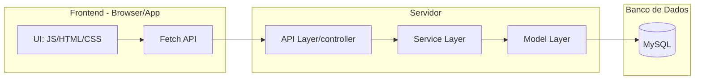

# System Design

```mermaid
flowchart LR
subgraph Client [Frontend - Browser/App]
UI[UI: JS/HTML/CSS]
APIcall[Fetch API]
end

subgraph Backend [Servidor]
APILayer[API Layer/controller]
Service[Service Layer]
model[Model Layer]
end

subgraph DB [Banco de Dados]
MySQL[(MySQL)]
end

UI --> APIcall
APIcall --> APILayer
APILayer --> Service
Service --> model
model --> MySQL
```
